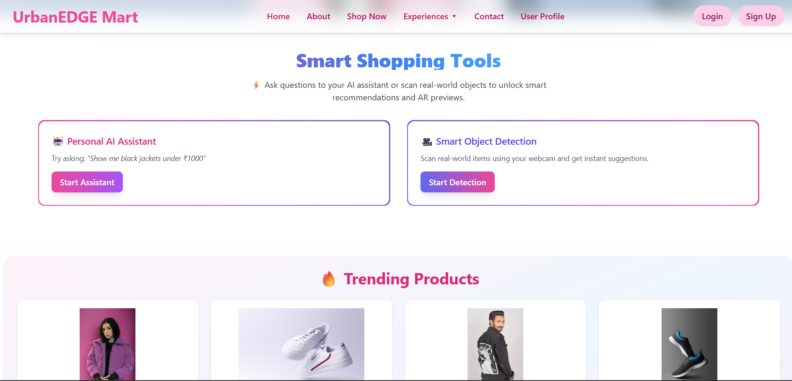
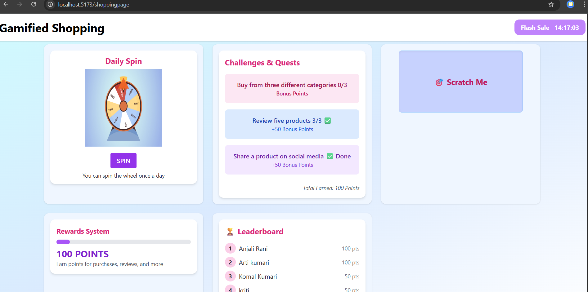

# 🛍️ UrbanEDGE Mart – Walmart Hackathon Project

UrbanEDGE Mart is a **next-gen smart e-commerce platform** designed to reimagine user experience. Powered by AI, AR, and Voice Assistance, it brings personalized and intuitive shopping to life. Built for the **Walmart Hackathon**, this project showcases innovation in user interaction, visual product detection, and voice-enabled search.

---

## 🚀 Features

### 🤖 AI-Powered Product Detection
- Real-time object detection using webcam via **TensorFlow COCO-SSD**
- Instantly suggests matching products based on detected items
- Smooth transition to product details

### 🧠 Voice Shopping Assistant
- Search products using **voice commands**
- Natural language understanding with AI backend (OpenRouter or Gemini)
- Instant product results based on user intent

### 🪄 Gamified Shopping
- Makes shopping more fun and interactive
- Spin wheel and Scratch Cards for crazy deals and discounts 
- Share products and get rewards 
- leader board functionality according to bonous points

### ❤️ Wishlist & Cart
- Add products to Wishlist with one click
- Move items from Wishlist to Cart
- Auth-protected routes using JWT

### 📝 Customer Testimonials
- Showcases real customer feedback
- Beautiful animated **carousel of reviews**
- Adds social proof and credibility

### 🧾 Smart Order Flow
- Select address
- Place orders
- Track previous orders

---

## 🧰 Tech Stack

| Frontend        | Backend         | AI / ML               | Other Tools        |
|-----------------|------------------|------------------------|--------------------|
| React.js        | Node.js + Express| TensorFlow.js (COCO-SSD)| Clerk/Auth (optional) |
| Tailwind CSS    | MongoDB + Mongoose | OpenRouter / Gemini API| React Router       |
| React Carousel  | JWT Auth         | Voice Recognition (Web Speech API) | Figma (UI Design) |
                  |cloudnary/nodemailer|OpenCV/MediaPipe/Numpy|
---


## 📸 Screenshots

|UrbanEDGE Mart|| Assistants | Virtual TryOn | Gamified |
|------------|----------------|-----------|--------------|
|||  |  |  |

---

## 🛠️ Installation & Setup

```bash
git clone https://github.com/your-username/Walmart-Hackathon.git
cd Walmart-Hackathon

# Backend
cd server
npm install
npm run dev

# Frontend
cd ../client
npm install
npm start

```

## Future Enhancements
Product Try-on using 3D models
Real-time chat assistant
Enhanced search accuracy using embeddings
Admin dashboard for inventory control
---

- Deployed link
- Video demo link
---

- # Contributors 
Aarti Kumari
Komal Kumari
Anjali Rani 
Sakshi Priya

